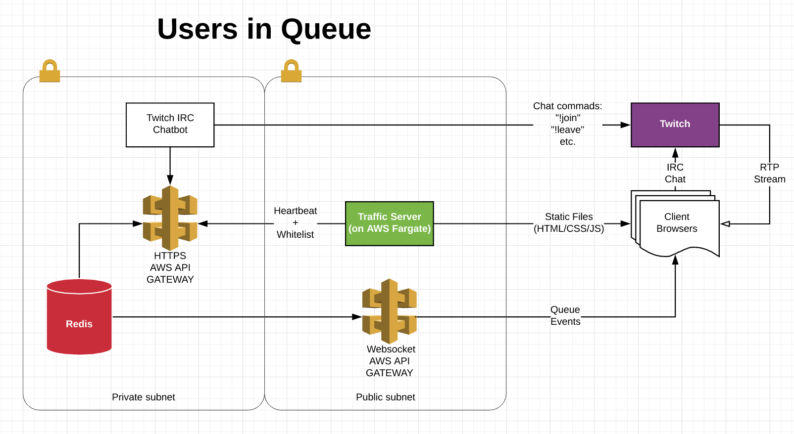
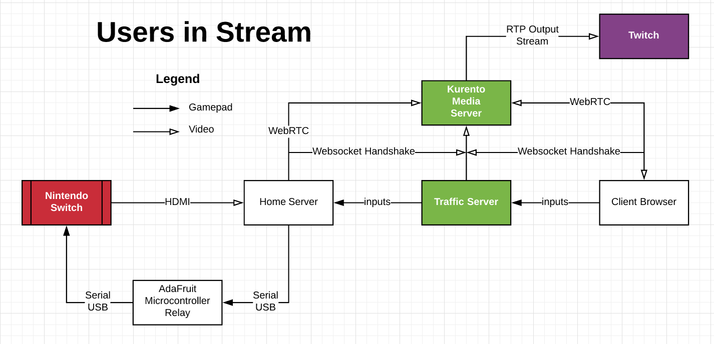

# Random Twitchers Play Random Games From my Nintendo Switch

### How This Works
You enter the Twitch stream, and wait in line. When you're up, a low-latency video 
connection of my Switch is streamed to your browser at an undisclosed URL. You can use a USB 
controller or your  keyboard to directly control my Nintendo Switch for a few minutes! 
When the time passes, the controls are passed to the next person in line.

The results are streamed onto Twitch. As a viewer I can see the game progress from start to 
completition; passing through the hands of people from all over the globe.

...This is how Animal Crossing should be played. 

### This is NOT typical "Twitch Plays"
Twitch Plays works by players entering in commands through Twitch Chat. The commands 
for input (A/B/Up/Down) are gathered over a window of time (say 15 seconds), and the
most commonly inputted command is relayed to the device. Kinda like an Ouji Board.

Random Twitch Plays allows for players to plug in their controller or keyboard, and assume
direct control for a period of time. Eventually the controls are passed to the next player in line.

### Architecture



#### Controller Inputs
```text
Controller Input: 
    Keyboard/Gamepad -> Client-Side Browser -> Traffic Server -> -> USB to Serial converter -> Switch 
```

A lot to digest here. Let's start with just inputs, which flows from client's web-browser to my Switch. The client sends 
a command to the Traffic Websocket Server, which is accessible from anywhere. 
The Traffic Server also does some verification to ensure no strange buttons are being pressed, and sends the command to 
my Home Server (AKA My Gaming PC). The PC sends the command directly to a
local Serial Port that has an USB to Serial converter connected, which translates the command to a controller-input for
the Nintendo Switch.

#### Video Output
```text
Video Output:
    Switch -> MageWell USB Capture Device -> Home Server -> Traffic Server (handshake) -> Kurento Media Server
        and
    Kurento Media Server -> Traffic Server (handshake) -> Client's Browser. 
        and
    (Peer to Peer WebRTC) Client Browser -> Client Browser
        and
    (Peer to Peer WebRTC) Client Browser -> WebRTC Turn Server -> Client Browser
        and 
    Kurento Media Server -> Twitch RTP destination

```  
Complicated Enough? Well let's confuse you even more by talking about video.
The issue here is that Twitch has ~7 seconds of delay (and sometimes even more than 30 seconds). You can't play games on
that, so we must do all we can to reduce latency.

My Switch feeds HDMI to my home PC through a Magewell Capture Device. This device turns the output into a 
low-latency USB3 WebCam.

Webcam output is relayed to Kurento Media Servia via a WebRTC stream. The handshake happens on the Traffic Websocket
Server to intiate the connection. For added security, the Traffic Websocket Server streams to a port only accessible
by my home IP address. From the other side of the diagram, the Client Browser initiates a handshake with the Traffic 
Websocket server, which is accessible from anywhere, and hooks into the same WebRTC stream.


### Giving Credit Where Credit is Due
* My Fiancée is in love with Animal Crossing, and I dedicate this little project to her.
* Switch Controller Relay [forked from this legend](https://github.com/Phroon/switch-controller) 
* [Kurento Media Server](https://github.com/Kurento/kurento-media-server) SDK for making WebRTC connections only a mild thorn in my side